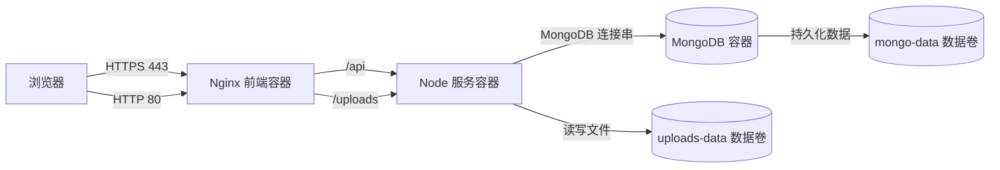

# Docker 部署说明（域名上线版）

## 部署拓扑



## 服务说明

- web：负责构建 Vite 前端，并通过 nginx 提供静态资源服务。
- server：运行编译后的 Express 应用，容器内端口为 3000。
- mongo：存储博客业务数据。
- uploads-data：持久化上传文件，避免容器重建后文件丢失。
- mongo-data：持久化 MongoDB 数据，避免容器重建后数据丢失。

## 第 0 步：购买域名前准备

1. 准备一台有固定公网 IP 的 Linux 服务器。
2. 确保云服务器安全组至少放通 80 和 443 端口。
3. 建议提前决定是否同时使用裸域和 `www` 域名。
4. 中国大陆服务器请先确认备案要求。

## 第 1 步：购买域名并配置 DNS

假设你的正式域名为 `example.com`：

1. 增加 `A` 记录：`@ -> 服务器公网 IP`。
2. 增加 `CNAME` 记录：`www -> @`。
3. 等待 DNS 生效后验证：

```powershell
nslookup example.com
nslookup www.example.com
```

## 第 2 步：准备环境变量

1. 先把仓库根目录的 `.env.example` 复制为 `.env`。
2. 把鉴权密钥和管理员密码替换成正式环境可用的强随机值。
3. 把 `CLIENT_URL` 和 `SERVER_BASE_URL` 改成你的正式域名（建议使用 `https://`）。
4. 如果前后端通过同一个 nginx 入口访问，`VITE_API_BASE_URL` 保持为 `/api`。

示例（将域名替换成你的真实域名）：

```dotenv
WEB_PORT=80
CLIENT_URL=https://example.com
SERVER_BASE_URL=https://example.com
VITE_API_BASE_URL=/api
```

## 第 3 步：首次启动容器（先 HTTP）

在 `infra` 目录下执行：

```powershell
docker compose --env-file ../.env -f docker-compose.yml up -d --build
```

验证：

1. 打开 `http://你的域名`，确认前端可访问。
2. 打开 `http://你的域名/api/health`，确认后端健康检查可用。

## 第 4 步：申请并部署 HTTPS 证书（Let's Encrypt）

本项目当前 `web` 容器使用 nginx，推荐按下面顺序执行：

1. 复制 TLS nginx 模板并替换域名：

```bash
cd infra
cp nginx.tls.conf.example nginx.tls.conf
```

2. 编辑 `nginx.tls.conf`，把 `example.com` 改成你的真实域名。
3. 临时停止占用 80 端口的服务：

```bash
docker compose --env-file ../.env -f docker-compose.yml stop web
```

4. 首次签发证书（宿主机执行）：

```bash
sudo apt-get update
sudo apt-get install -y certbot
sudo certbot certonly --standalone -d example.com -d www.example.com
```

5. 切换到 TLS compose 覆盖文件并重建：

```bash
docker compose --env-file ../.env -f docker-compose.yml -f docker-compose.tls.yml up -d --build
```

6. 验证 HTTPS：

```bash
curl -I https://example.com
curl -I https://example.com/api/health
```

说明：

1. 证书路径通常在 `/etc/letsencrypt/live/<domain>/`。
2. 证书续期建议使用 `certbot renew` 定时任务。
3. 每次证书续期后记得重载 nginx（或重启 `web` 容器）。

## 第 5 步：更新与日常运维

更新服务：

```powershell
docker compose --env-file ../.env -f docker-compose.yml up -d --build
```

停止服务：

```powershell
docker compose --env-file ../.env -f docker-compose.yml down
```

查看状态：

```powershell
docker compose --env-file ../.env -f docker-compose.yml ps
```

查看日志（以 server 为例）：

```powershell
docker compose --env-file ../.env -f docker-compose.yml logs -f server
```

## 第 6 步：上线验收清单

1. `https://你的域名` 页面可正常访问。
2. `https://你的域名/api/health` 返回健康状态。
3. 上传图片后重启 `server` 容器，文件仍存在。
4. 浏览器地址栏证书可信且未过期。

## 常见问题

1. 域名能 ping 通但网页打不开：优先检查安全组、服务器防火墙和 80/443 端口映射。
2. 前端请求失败：检查 `VITE_API_BASE_URL` 是否为 `/api`，并确认 nginx 的 `/api/` 反代配置存在。
3. 修改 `VITE_API_BASE_URL` 后不生效：它是构建时变量，需要重建 `web` 镜像。
4. 登录回调或跨域问题：检查 `CLIENT_URL` 与实际对外域名是否完全一致（协议、域名、端口）。

## 当前仓库相关说明

1. 后端会通过 `apps/server/src/load-env.ts` 读取仓库根目录下的 `.env`。
2. 前端的 `VITE_API_BASE_URL` 属于构建时变量，修改后需要重新构建 web 镜像。
3. 如果你修改了 `WEB_PORT`，需要同时把 `CLIENT_URL` 和 `SERVER_BASE_URL` 改成一致的对外访问地址。